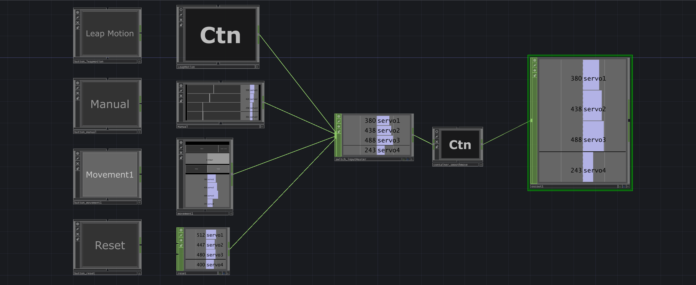

# TouchDesigner Robot Arm

A 4-DOF robot arm with three control modes: live gesture control via Leap Motion, pre-programmed keyframe sequences, and a manual slider interface.

## Overview

The system uses a split-stack architecture. TouchDesigner handles gesture input and animation logic at the high level. A dedicated openFrameworks application written in C++ manages low-level communication with the Dynamixel SDK and U2D2 hardware. The two processes run on one computer and exchange data over localhost UDP.

This separation keeps the interaction layer flexible. Control modes can be swapped or extended in TouchDesigner without touching the serial communication code.

## Signal Flow

```
[Leap Motion] ---> (USB HID) ---> [TouchDesigner]
[TouchDesigner] ---> (localhost UDP) ---> [openFrameworks / C++] ---> (USB Serial) ---> [U2D2] ---> (Half-Duplex TTL Serial) ---> [4x Dynamixel AX-12A]
```

**Split-stack architecture.** TouchDesigner runs the control logic and UI. The openFrameworks app acts as a bridge layer: it receives UDP values, validates them, and sends Dynamixel commands. Keeping those responsibilities separate makes each side easier to test and change.

**Half-Duplex TTL Serial.** The U2D2 manages the Dynamixel bus, sending command packets to individual servo IDs and listening for responses. The openFrameworks app handles this through the Dynamixel SDK.

## Control Modes

- **Gesture:** Leap Motion tracks hand position in real time. TouchDesigner maps joint positions to servo targets and streams them over UDP.
- **Animated:** TouchDesigner's Animation COMP drives repeatable keyframe sequences. A Python script inside the `.toe` file generates the keyframe table from a pose table, so choreography can be defined as data rather than manually edited curves.
- **Manual:** A slider UI gives direct control over each servo independently.

 

## Hardware

**Leap Motion Controller** gesture sensor

**Robotis U2D2** USB-to-Dynamixel adapter

**Dynamixel AX-12A** servos (4)

**Robotis Bioloid Frames** for arm structure

## Software

- **TouchDesigner** 2023.12370 or newer
- **Visual Studio** 2022 Community (with C++ development tools)
- **openFrameworks** `of_v20241228_vs_64_release` — [Download](https://openframeworks.cc/download/)
- **Dynamixel SDK** — [Download](https://github.com/ROBOTIS-GIT/DynamixelSDK)
- **Dynamixel Wizard 2.0** for assigning servo IDs
- **R+ Design** for the Robotis STEM L2 arm assembly guide

## Setup

### Hardware

1. Assemble the arm using the Robotis Bioloid Frames, AX-12A servos, and R+ Design instructions.
2. Use Dynamixel Wizard 2.0 to assign a unique ID (1, 2, 3, 4) to each servo.
3. Connect the servos to the U2D2 adapter and plug both the U2D2 and Leap Motion Controller into your computer via USB.

### Software

1. Install Visual Studio, openFrameworks, and the Dynamixel SDK.
2. Place the `DynamixelController` folder inside your openFrameworks `apps/myApps/` directory.
3. Open `DynamixelController.sln` in Visual Studio and build the solution (Ctrl+Shift+B). The compiled `.exe` will appear in the `bin` folder.

## Running the System

1. Run `DynamixelController_debug.exe` from the `DynamixelController/bin` folder.
2. Open `touchdesigner/motor-control-system_007.toe`.
3. Use the mode buttons in the TouchDesigner network to switch between gesture, animated, and manual control.

## Keyframe Generation

The `.toe` file includes a Python script called `generate_keys_script`. It reads servo poses from the `null_table_keys` table and generates the correctly formatted `keys` table that drives the Animation COMP. Defining poses as table rows is faster than editing animation curves by hand and makes it straightforward to rearrange or extend a sequence.

## Demos

- [Gesture-Controlled Pick and Place](https://youtu.be/poKgKCw8hp4)
- [Pre-Programmed Automated Movement](https://youtu.be/FgYoJYX6Q9w)
