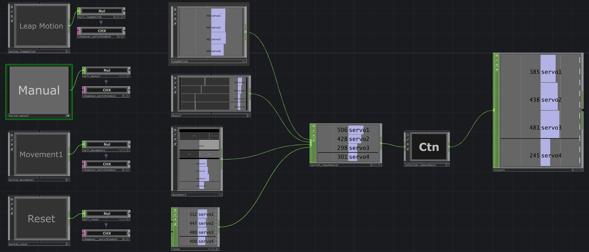

# Robot Arm Control System

A versatile system for controlling a 4-DOF robot arm using TouchDesigner, OpenFrameworks, and a Leap Motion sensor.

## Features

A flexible control system with multiple input modes:
- **Real-time Gesture Control:** Using a Leap Motion sensor for direct manipulation.
- **Pre-Programmed Automation:** Using TouchDesigner's Animation COMP for repeatable keyframe sequences.
- **Manual Slider Control:** A UI for direct control over each servo.

---

## I/O DIAGRAM
```
INPUT:  [Leap Motion Camera (Sensor)] ---> (USB HID) ---> [Computer/TouchDesigner (Processor/VPL)]
OUTPUT: [Computer/TouchDesigner (Processor/VPL)] ---> (localhost UDP) ---> [Computer/openFrameworks, Visual Studio (Processor/C++)] ---> (USB Serial) ---> [U2D2 (Motor Control Board)] ---> (Half-Duplex TTL Serial) ---> [4x Dynamixel Servos (Actuator)]
```
> - **Dual Software Processors:** This workflow uses two software processors on one computer. 
> 	- TouchDesigner handles the high-level user input and animation logic.
> 	- A dedicated openFrameworks application (written in C++) handles the low-level communication with the Dynamixel SDK and the U2D2 hardware.
> - **Half-Duplex TTL Serial:** This is the specific protocol used by Dynamixel servos. The U2D2 controller manages this bus, sending command packets to specific servo IDs and listening for responses.


 
> - Screenshot of Touchdesigner network

---

### Hardware Requirements

*   Leap Motion Controller
*   Robotis U2D2 Adapter
*   4x Dynamixel AX-12A Servos
*   Robotis Bioloid Frames

### Software Requirements

*   **TouchDesigner:** 2023.12370 or newer
*   **Visual Studio:** 2022 Community (with C++ development tools)
*   **openFrameworks:** `of_v20241228_vs_64_release` ([Download](https://openframeworks.cc/download/))
*   **Dynamixel SDK:** ([Download](https://github.com/ROBOTIS-GIT/DynamixelSDK))
*   **Dynamixel Wizard 2.0:** (For configuring servo IDs)
*   **R+ Design** 3D guide to construct the Robotis STEM - L2 Robot Arm

---

### Setup & Installation

#### 1. Hardware Configuration
1.  **Assemble the Robot Arm:** Build the 4-DOF arm using the Robotis Bioloid Frames, Dynamixel AX-12A servos, and R+ Design instructions.
2.  **Configure Servo IDs:** Use the Dynamixel Wizard 2.0 software to assign a unique ID (1, 2, 3, 4) to each servo motor.
3.  **Connect Hardware:** Connect the servos to the U2D2 adapter, and plug the U2D2 and the Leap Motion Controller into your computer via USB.

#### 2. Software Setup
1.  **Download Dependencies:** Make sure you have installed Visual Studio, openFrameworks, and the Dynamixel SDK as listed in the sections below.
2.  **Place Project:** Unzip this repository and place the `DynamixelController` folder inside your openFrameworks `apps/myApps/` directory.
3.  **Build Project:** Open the `DynamixelController.sln` file in Visual Studio and build the solution (Ctrl+Shift+B). This will create the runnable `.exe` file inside the `bin` folder.

### Running the System
1.  **Run the Controller App:** Run the `DynamixelController_debug.exe` file located in the `DynamixelController/bin` folder.
2.  **Run TouchDesigner:** Open the `touchdesigner/motor-control-system_007.toe` file.
3.  **Interact:** Use the buttons in the TouchDesigner network to switch between the different control modes.

#### Note: Python Script for Keyframe Generation
The `motor-control-system_007.toe` file contains a Python script (`generate_keys_script`) designed to automate the creation of keyframe animations.

This script provides a fast, data-driven way to create and modify complex choreographies. Instead of manually editing curves in the Animation Editor, you can simply define servo "poses" in a table (`null_table_keys`), and the script will automatically generate the correctly formatted `keys` table to drive the Animation COMP.

---

### Project Links & Demos

*   **Project Write-up:** [stevenmbenton.com/robotic-arm-control-system](https://stevenmbenton.com/robotic-arm-control-system/)
*   **YouTube Demo:** [Gesture-Controlled 'Pick and Place'](https://youtu.be/poKgKCw8hp4)
*   **YouTube Demo:** [Pre-programmed Automated Movement](https://youtu.be/FgYoJYX6Q9w)
